**Commutation :** transfert de connexions d'un ensemble de conducteur à un autre.

**1. Commutation de circuit :**

Le circuit est établi au préalable,  la ligne de communication entre l'émetteur et le récepteur est **réservée**. Si personne ne répond, un signal de retour annule la réservation de la ligne.
Une fois la communication établie, toutes les données empruntent ensuite ce même chemin prédéfini (signal numérique transmis entre commutateurs).

Mais la commutation de circuit coûte cher, surtout lorsque l'émetteur et le récepteur sont éloignés.

On a ici une **réservation de ressources dite déterministe.**

En 1971, **Louis Pouzin**, polytechnicien et chercheur de grand talent, propose quelque chose de totalement nouveau : un réseau maillé d'ordinateurs basé sur la commutation de paquets.

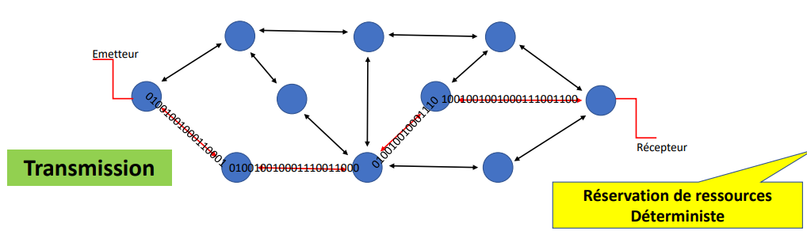

**2. Commutation de paquets (mieux que commutation de circuits):**

Dans ce type de commutation, aucun circuit n'est prédéfini entre l'émetteur et le récepteur.

Les paquets n'empruntent pas forcément le même chemin. C'est ce qu'on appelle **best effort delivery**.

La **réservation de ressources est dite indéterministe.**

La commutation par paquets est mieux que celle vue précédemment, parce que le fait de ne pas avoir à établir un circuit de bout en bout apporte une souplesse cruciale :

- Les données peuvent être découpées en morceaux
- Les noeuds peuvent organiser des fils d'attente
- Ce principe permet de partager les flux

Les moyens mis en oeuvre pour accélérer un lien sont :

- augmenter la cadence d'émission des bits (Mbits/s, Gb/s, ...)
- émettre les données en parallèle, en utilisant des techniques de multiplexage.

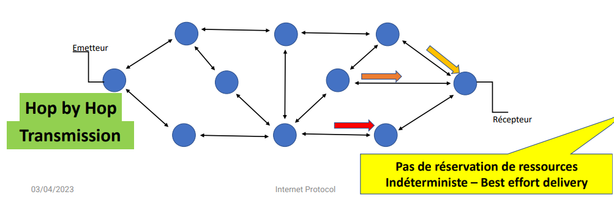

- Le réseau à commutation de paquets nécessite des nœuds d’aiguillage qui
sont, dans un premier temps, des ordinateurs (TCProgram), puis deviennent
des routeurs (TCProtocol) spécialisés (ou des Systèmes-Intermédiaires - OSI)
- Chaque paquet est entièrement chargé en mémoire avant d’être retransmis
- Comme aucune ressource n’est réservée au préalable, certains paquets
peuvent être rejetés en cas de congestion ou de destination inaccessible.

IP (Internet Protocol) ne transporte rien, il organise le système postal. Sa force est liée à son mode déconnecté (c'est-à-dire qu'il n'établit pas de liaison continue entre l'expéditeur et le destinataire avant d'envoyer les données) et son indéterminisme (IP ne garantit pas un chemin unique ou prédéterminé pour les paquets).

IP surpasse toutes les autres technologies car il est nettement moins cher, le réseau mondial est surdimensionnée (donc peu "d'embouteillages").

## Routeur

Un **routeur** est un ordinateur spécialisé pour cette tache, ou une machine standard configurée pour cela. Il assure deux tâches essentielles :

- la communication de paquets : choisir la meilleure interface de sortie en fonction de la destination d'un paquet et des informations de la table de routage (= panneau d'indicateurs)
- la gestion des protocoles de routage : échanger des informations avec d'autres routeurs pour maintenir et faire évoluer sa table de routage.

Un routeur peut être **"intérieur"** ou **"en bordure"**.

Quand un paquet est destiné à autre chose qu’une adresse interne, il est dirigé vers le routeur de bordure le plus proche.

**SA** = Système Autonome, c'est un ensemble de routeurs et de liens administrés par une même organisation : admnistration publique, entreprise, opérateur, ...

Un routeur est dit "en bordure" lorsqu'il se trouve entre des SA.

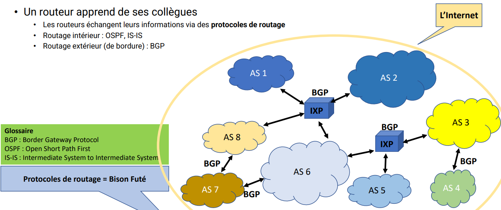

Internet est constitué d'une multitude de routeurs situés dans des IXP (Internet Exchange Point) répartis un peu partout dans le monde.

**OSPF** et **IS-IS** sont deux protocoles permettant de trouver la communication la moins chère pour passer d'un endroit à un autre.

Les routeurs de la DFZ (Default Free Zone) connaissent toutes les routes mondiales (610 000 routes).

## Fonctionnement OSPF

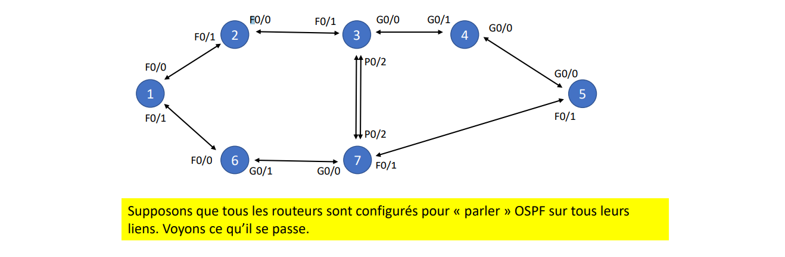
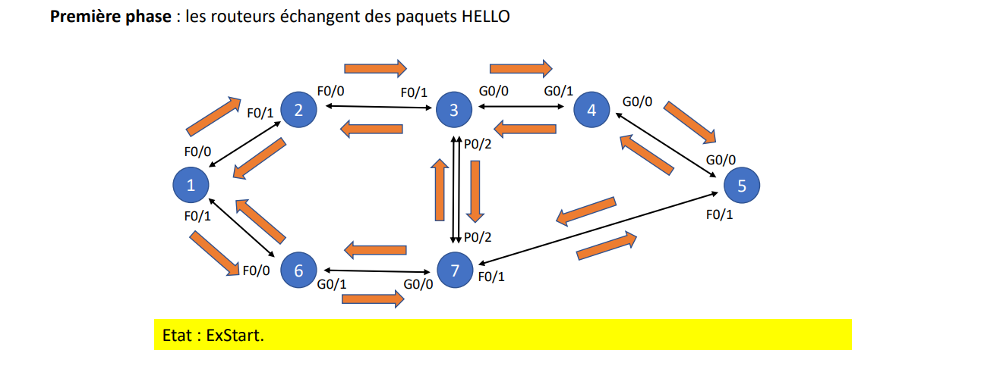
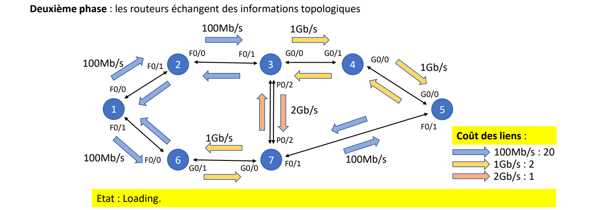
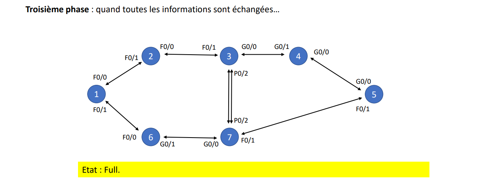
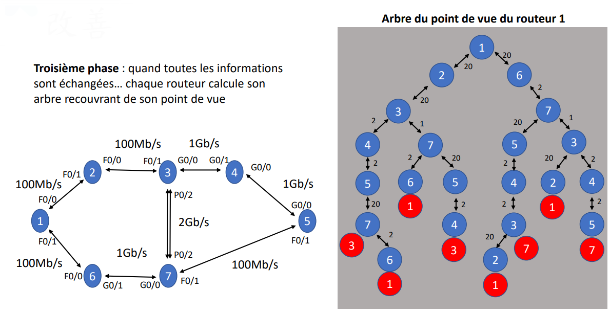
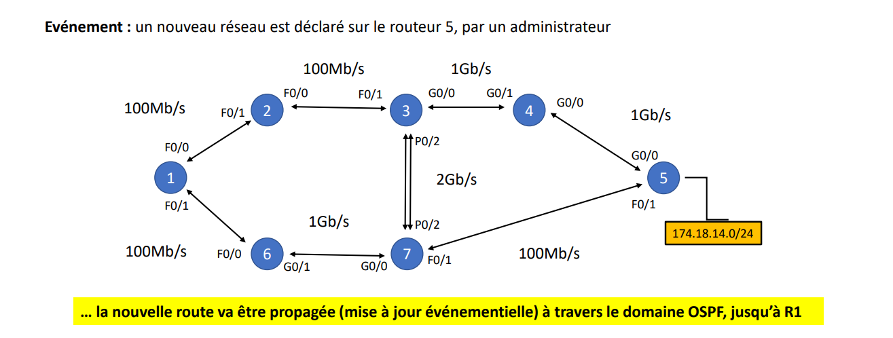
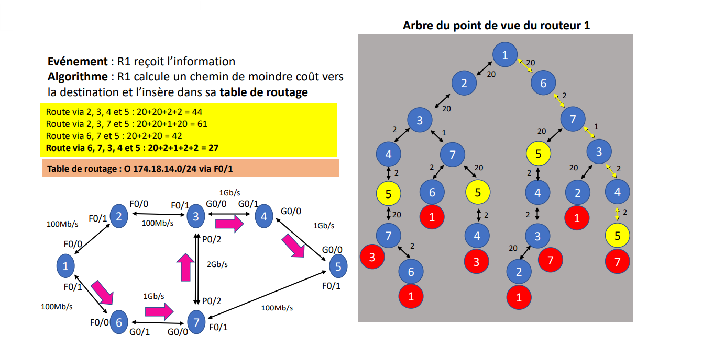
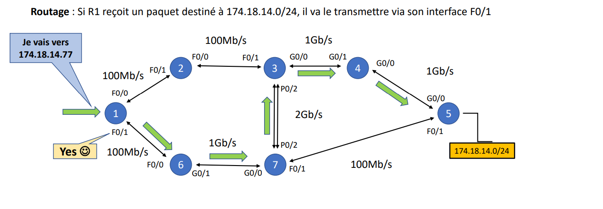
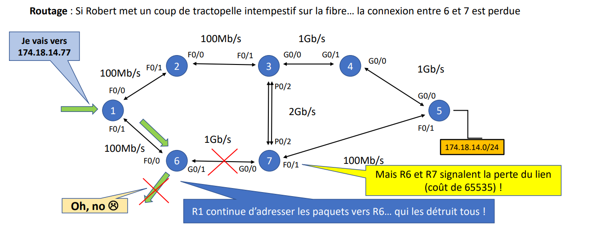
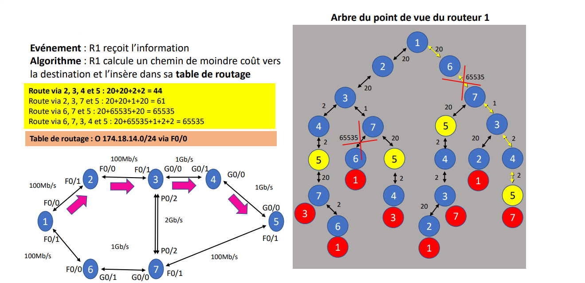
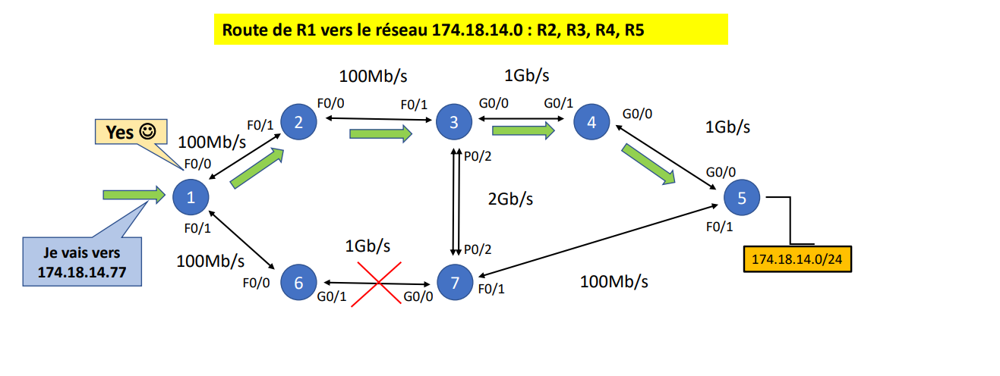

## Principe BGP (Border Gateway Protocol)

Il est peu utile d’entrer dans les détails du fonctionnement de BGP.
Ce qu’il faut retenir, c’est que les routeurs se débrouillent pour
« annoncer » les réseaux et « choisir » les meilleures routes.

Internet est une collection de SA connectés via les IXP.

A l’intérieur de chaque SA, les réseaux sont annoncés par les
protocoles de routage intérieur.

Entre les SA, les réseaux sont annoncés par BGP.

Ce qu’il se passe à l’intérieur d’un SA n’a aucune incidence sur
les autres SA.

## Calcul d'adresses et masque de réseau (TP2)

Le réseau **175.22.220.64/28** a été accordé par l'IANA à l'hébergeur du service Web/DNS.

### Quel est le nombre d'adresses disponibles dans ce réseau ?

Un masque /28 signifie qu'il y a :

- 32 - 28 = 4 bits disponibles pour les adresses hôtes.
- Total d'adresses : 2^4 = 16.
- Mais 2 adresses sont réservées :
  - 1 pour l'adresse réseau (première adresse)
  - 1 pour l'adresse de broadcast (dernière adresse)

**Adresses utilisables pour les hôtes :** 16 - 2 = 14.

---

### Quelle est la première adresse IP de ce réseau ?

L'adresse réseau est la première adresse d'un sous-réseau. Elle est obtenue en mettant tous les bits hôtes à 0 dans l'adresse IP.

**Masque de sous-réseau :**

```
/28 signifie que les 28 premiers bits sont réservés :
255.255.255.240 -> 11111111.11111111.11111111.11110000
```

**Adresse IP de base :**

```
175.22.220.64 -> 10101111.00010110.11011100.01000000
```

L'adresse réseau correspond à la 1ère adresse du bloc, obtenue par un ET logique entre l'adresse IP et le masque :

```
10101111.00010110.11011100.01000000
11111111.11111111.11111111.11110000
-----------------------------------
10101111.00010110.11011100.01000000 -> 175.22.220.64
```

**Première adresse IP du réseau :** 175.22.220.64

---

### Quelle est la dernière adresse IP de ce réseau ?

La dernière adresse utilisable est l'adresse juste avant l'adresse de diffusion (broadcast).

**Calcul :**

```
Adresse réseau + (Total adresses - 1) = 175.22.220.64 + (16 - 1)
175.22.220.64 + 15 = 175.22.220.79
```

**Dernière adresse utilisable :** 175.22.220.78

---